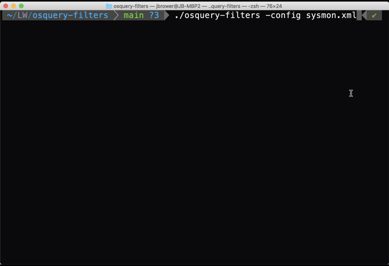

 osquery-filters

This app takes a sysmon config as input and converts the relevant process auditing filters into a SQL query that osquery can use.

This project would not have gotten off the ground without the input & expertise from:
- Seth Hanford - @sethhanford: 
- Fritz Ifert-Miller - https://medium.com/@fritz_

# Demo

